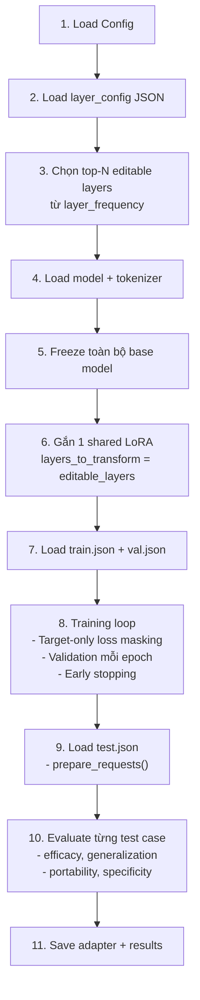

# Unified Shared LoRA — Implementation Plan (v2)

## Mục tiêu

Tạo folder `SharedLoRA/` chứa pipeline hoàn chỉnh: chia data → train shared LoRA → evaluate. Copy đầy đủ các module cần thiết từ EDAPI để chạy độc lập.

> [!IMPORTANT]
> **Hiện tại chỉ có `selected_layer_groups.json` cho deepseek-1.3b** (24 layers, model nhỏ nhất).  
> Các model khác (codegemma-2b, qwencoder-3b) chưa có layer config → cần chạy `analyze_and_select_layers.py` cho từng model nếu muốn mở rộng sau.  
> Plan này đi trước với **deepseek-1.3b**.

## Cấu trúc folder

```
SharedLoRA/
├── run.py                      # [NEW] File chính: train + evaluate
├── split_data.py               # [NEW] Chia data thành train/val/test
├── config/
│   └── deepseek-1.3b.yaml      # [NEW] Hyperparameters
├── data/
│   └── deepseek-1.3b/
│       ├── all.json             # [COPY] từ EDAPI  
│       ├── train.json           # [GENERATED] bởi split_data.py
│       ├── val.json             # [GENERATED]
│       └── test.json            # [GENERATED]
├── layer_config/
│   └── deepseek-1.3b/
│       └── selected_layer_groups.json  # [COPY] từ Layer_important
├── evaluate/                    # [COPY] từ EDAPI codellmeditor/evaluate/
│   ├── __init__.py
│   ├── edapi_evaluate.py        # Sửa import paths
│   ├── evaluate_utils.py        # Sửa import paths
│   ├── bleu/
│   │   ├── bleu.py
│   │   ├── bleu_.py
│   │   └── tokenizer_13a.py
│   └── rouge/
│       ├── rouge.py
│       ├── app.py
│       └── README.md
└── results/                     # [GENERATED] Output directory
```

## Proposed Changes

---

### 1. Data Splitting

#### [NEW] [split_data.py](file:///Users/huytrannn13/Desktop/Research_API_2026/SharedLoRA/split_data.py)

Chia `all.json` thành 3 tập **stratified by API** (để đảm bảo mỗi API có mặt trong cả 3 tập):

| Tập | Tỷ lệ | Mục đích |
|-----|--------|----------|
| `train.json` | 70% | Train shared LoRA |
| `val.json` | 15% | Early stopping |
| `test.json` | 15% | Final evaluation (efficacy, generalization, portability, specificity) |

- **Stratify theo `replacement api`** → đảm bảo coverage cho tất cả 45 APIs
- Seed cố định = 42 để reproducible

```bash
python split_data.py --input data/deepseek-1.3b/all.json --output_dir data/deepseek-1.3b/
```

---

### 2. Evaluate Module (Copy + sửa imports)

#### [COPY] evaluate/
Copy nguyên từ `EDAPI-Bench-main/codellmeditor/evaluate/` với các thay đổi:
- `evaluate_utils.py`: Sửa import path `from codellmeditor.evaluate.bleu.bleu import Bleu` → `from evaluate.bleu.bleu import Bleu` và ROUGE path thành relative
- `edapi_evaluate.py`: Sửa `from ..util import ...` → inline hoặc import trực tiếp
- Copy nguyên các file trong `bleu/` và `rouge/`

---

### 3. Main Pipeline

#### [NEW] [run.py](file:///Users/huytrannn13/Desktop/Research_API_2026/SharedLoRA/run.py)

File chính duy nhất (~500 dòng), flow:



**Chi tiết từng phần:**

##### 3a. Layer Selection (từ JSON)
```python
# Đọc selected_layer_groups.json
layer_frequency = config["layer_frequency"]  # {"12": {"count": 40}, "13": {"count": 39}, ...}
common_layers = config["common_layers"]       # [1, 16, 17, 18, 19, 20, 22, 23]

# Chọn top-8 theo count (đã exclude common)
sorted_layers = sorted(layer_frequency.items(), key=lambda x: -x[1]["count"])
editable_layers = [int(l) for l, _ in sorted_layers[:8]]
# → [12, 13, 15, 14, 21, 10, 0, 11]
```

##### 3b. Model + LoRA Setup
- Load model bằng `AutoModelForCausalLM.from_pretrained()` (logic từ `llms.py`)
- Freeze toàn bộ → `model.requires_grad_(False)`
- Gắn 1 `LoraConfig` với `layers_to_transform=editable_layers`

##### 3c. Training Loop
- Optimizer: `AdamW`, lr nhỏ, weight_decay
- Loss masking: prompt tokens → -100, chỉ tính loss trên target
- Validation loss mỗi epoch
- Early stopping: patience=3

##### 3d. Evaluation
- Gọi `prepare_requests()` cho test set
- Với từng case: `compute_edit_quality()` → 4 metrics
- Aggregate mean ± std → save JSON

##### 3e. Source Utils (inline trong run.py)
Copy các function cần thiết:
- `extract_first_func()`, `clean_pred()`, `extract_apis_in_first_stmt()`, `extract_first_statement()`

---

### 4. Config

#### [NEW] [config/deepseek-1.3b.yaml](file:///Users/huytrannn13/Desktop/Research_API_2026/SharedLoRA/config/deepseek-1.3b.yaml)

```yaml
model_name: deepseek-ai/deepseek-coder-1.3b-base
device: 0
num_editable_layers: 8
lora_type: lora
rank: 4
lora_alpha: 16
lora_dropout: 0.1
target_modules: ["q_proj", "v_proj"]
lr: 2e-4
weight_decay: 0.01
num_epochs: 5
batch_size: 2
patience: 3
max_gen_length: 50
```

| Parameter | Giá trị | So với EDAPI gốc | Lý do |
|-----------|---------|-------------------|-------|
| rank | 4 | 8 | Nhỏ hơn → ít lệch general knowledge |
| lora_alpha | 16 | 32 | α/r = 4, tỷ lệ hợp lý |
| lr | 2e-4 | 5e-3 (LoRA) / 5e-4 (Routed) | Conservative |
| weight_decay | 0.01 | 0 | Regularization |
| batch_size | 2 | 1 | Ổn định gradient hơn |
| num_epochs | 5 | 30 steps (LoRA) / 10 epochs (Routed) | Có early stopping |

---

### 5. Data Copy

| Source | Destination | Action |
|--------|-------------|--------|
| `EDAPI/.../data/EditDeprecatedAPI/deepseek-1.3b/all.json` | `SharedLoRA/data/deepseek-1.3b/all.json` | COPY |
| `Layer_important/selected_layer_groups.json` | `SharedLoRA/layer_config/deepseek-1.3b/selected_layer_groups.json` | COPY |
| `EDAPI/.../codellmeditor/evaluate/bleu/*` | `SharedLoRA/evaluate/bleu/*` | COPY |
| `EDAPI/.../codellmeditor/evaluate/rouge/*` | `SharedLoRA/evaluate/rouge/*` | COPY |
| `EDAPI/.../codellmeditor/evaluate/evaluate_utils.py` | `SharedLoRA/evaluate/evaluate_utils.py` | COPY + sửa imports |
| `EDAPI/.../codellmeditor/evaluate/edapi_evaluate.py` | `SharedLoRA/evaluate/edapi_evaluate.py` | COPY + sửa imports |

---

## Verification Plan

### Automated Tests
```bash
# 1. Chia data
cd SharedLoRA
python split_data.py --input data/deepseek-1.3b/all.json --output_dir data/deepseek-1.3b/

# 2. Dry-run (kiểm tra layer selection + LoRA setup, không cần GPU)
python run.py --config config/deepseek-1.3b.yaml --dry_run

# 3. Full training + eval (cần GPU)
python run.py --config config/deepseek-1.3b.yaml
```

### Expected Output
```
results/deepseek-1.3b/
├── adapter/              # LoRA adapter weights
├── run_000.json          # Per-case metrics
├── mean_run_000.json     # Aggregated metrics
└── training_log.json     # Loss curves
```

## Open Questions

> [!IMPORTANT]
> Hiện chưa có `selected_layer_groups.json` cho **codegemma-2b** và **qwencoder-3b**. Nếu muốn chạy cho các model đó, cần chạy `analyze_and_select_layers.py` trước (cần file `importance.json` cho từng model, file này được tạo bởi `importance_calculate.py` trong EDAPI). Bạn muốn tôi hỗ trợ phần này sau không?
